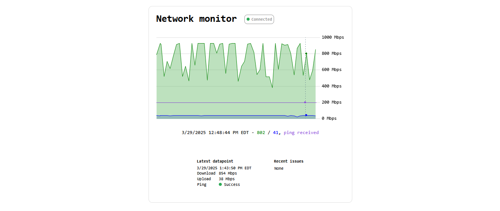

# ping-graph



A simple web app that displays a real-time graph of ping and network speed data. The server is designed to be a long-running service on a Linux host.

The server pings a few highly available DNS servers (Google, OpenDNS, and Cloudflare) for ping information, and uses a Go API for speedtest.net to get download/upload speed information.

Install / uninstall as systemd service:
```
build_install.sh
uninstall.sh
```

Build the server directly:
```bash
go build -o server server/server.go server/websocket.go server/version.go
```
